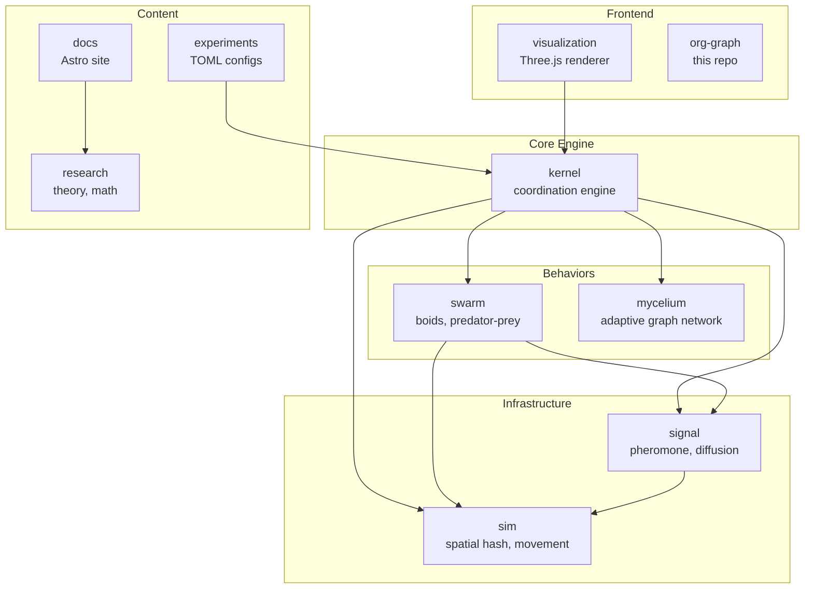

# org-graph

Interactive visualization of the Unstable Kernel organization structure and repository dependencies.

## Live

Deployed at: `https://unstable-kernel.github.io/org-graph/`

## Architecture



## Features

- D3 force-directed graph layout
- Draggable nodes
- Color-coded by category (core, behavior, infra, content, frontend)
- Hover tooltips with repo descriptions
- Click to open repo on GitHub
- Edge labels showing relationship type

## Setup

```bash
npm install
npm run dev
```

## Tech Stack

- React 18
- D3.js 7 (force simulation)
- TypeScript
- Vite

## License

MIT
